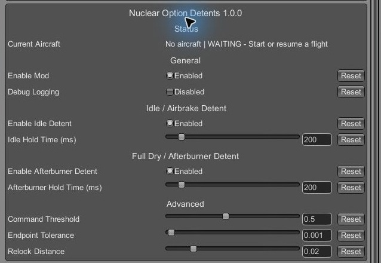

# Nuclear Option Detents

A small client-side BepInEx 5 mod for the Windows Steam version of Nuclear
Option that stops you from opening the airbrake or lighting the afterburner
by accident.

With relative throttle controls (the default keyboard throttle), the ends of
the throttle range are also switches: reaching 0% opens the automatic
airbrake, and pushing past full dry thrust engages the afterburner. One tap
too many and you've deployed the airbrake on final or lit the burner while
trying to hold full military power.

This mod adds a detent at each end, like the physical stop on a real HOTAS
throttle that you push through deliberately:

- The throttle now stops just above 0%. Keep holding decrease for 200 ms to
  push through to true idle and let the automatic airbrake open.
- The throttle now stops at full dry thrust. Keep holding increase for 200 ms
  to push through into afterburner.

Release the key early and the throttle just stays at the stop; nothing
triggers. Once you've pushed through, the throttle behaves exactly as vanilla
until you move away from that end again. Both hold times are configurable
(0 to 2000 ms) and each detent can be disabled.

The mod only touches the local player's relative-throttle input on the 13
supported aircraft (listed in
[docs/AIRFRAME-PRESETS.md](docs/AIRFRAME-PRESETS.md)). It never turns the
afterburner on by itself. Absolute/HOTAS throttle mode, helicopters,
unknown aircraft, AI, and remote aircraft are untouched, as are weapons and
networking. Multiplayer use is unverified, and hosts or server moderators may
prohibit BepInEx or this mod.

This is a v0.1 prototype. Installed-build notes for contributors are in
[docs/COMPATIBILITY.md](docs/COMPATIBILITY.md).



## Install

Download the plugin-only, standalone, or NOMM ZIP from the
[releases page](https://github.com/baanish/NO-Throttle-Detents/releases).
Each release includes a `SHA256SUMS.txt` for the archives. Building from
source is optional; see the section below.

For an existing BepInEx installation, extract the plugin-only ZIP into the
folder containing `NuclearOption.exe` and merge its `BepInEx` folder. The
plugin is installed at:

```text
BepInEx\plugins\NuclearOptionDetents\NuclearOptionDetents.dll
```

For a fresh install, extract the standalone ZIP directly beside
`NuclearOption.exe`. It includes BepInEx and the mod's default config. Do not
add an extra wrapper directory or extract it over an existing BepInEx
installation. This release supports BepInEx 5; BepInEx 6 will not load it.

The mod config is:

```text
BepInEx\config\com.baanish.nuclearoption.detents.cfg
```

The standalone ZIP includes the default file. The plugin-only ZIP omits it;
BepInEx creates it on first launch and preserves existing settings.

Nuclear Option Mod Manager uses the separate flat `-nomm.zip` artifact. Do not
manually extract that archive into the game directory. NOMM installs it inside
its managed plugin directory and supplies BepInEx.

To remove or disable only this mod, delete its plugin directory or rename the
DLL. Leave unrelated BepInEx and game files alone.

## Configuration

The default config is:

```ini
[General]
Enabled = true
DebugLogging = false

[Status]
RuntimeStatus = Open the in-game Configuration Manager to see the live check.

[Idle / Airbrake Detent]
Enabled = true
HoldMilliseconds = 200

[Full Dry / Afterburner Detent]
Enabled = true
HoldMilliseconds = 200

[Advanced]
CommandThreshold = 0.5
EndpointEpsilon = 0.001
ResetHysteresis = 0.02
```

Each detent has its own switch and dwell from 0 to 2000 ms. A zero dwell
unlocks on the first qualifying endpoint update. `CommandThreshold` is the
raw input magnitude required to hold; `1.0` requires full-scale input.
`EndpointEpsilon` tolerates float noise; `ResetHysteresis` controls how far the
throttle must move away before an unlocked detent relocks and is always at
least the endpoint tolerance. `DebugLogging` is off by default and is useful
when diagnosing a local install.

The mod does not require Configuration Manager. Text-file changes apply on
the next launch.

Other mods that rewrite throttle, airbrake, afterburner, or autopilot behavior
may conflict with these patches. Test them together before relying on either.

## Compatibility and testing

The installed-build snapshot in [docs/COMPATIBILITY.md](docs/COMPATIBILITY.md)
records the game version, patch points, and fields inspected during
development. It is contributor reference, not a promise that future game
builds will work. After a game update, run the mod and the focused core tests;
those tests do not exercise Harmony installation or live-game integration.

Recorded v0.1 testing covered identity and readiness on all 13 allowlisted
airframes plus reduced-dwell upper/lower control-path checks on FS-12, FS-20,
KR-67, and AB-4.

## Build from source

From PowerShell 7, run the one-command build:

```powershell
pwsh ./build/Build.ps1
```

The script runs the focused core executable tests, builds the Release plugin,
creates the NOMM, manual plugin-only, and standalone ZIP layouts, and validates
their contents. It finds Nuclear Option through Steam locations when possible.
To select it explicitly, pass a directory or set the environment variable:

```powershell
pwsh ./build/Build.ps1 -GameDir 'C:\Games\Nuclear Option'
$env:NUCLEAR_OPTION_DIR = 'C:\Games\Nuclear Option'
pwsh ./build/Build.ps1
```

Artifacts are written to `dist`. The source is MIT licensed; see
`THIRD_PARTY_NOTICES.md` for bundled dependency attribution.
