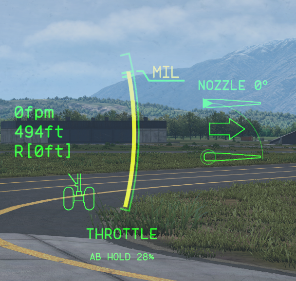
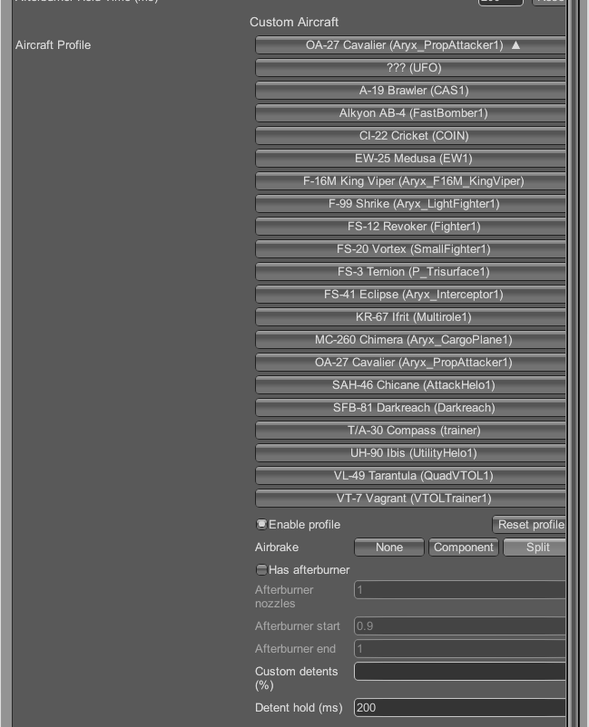
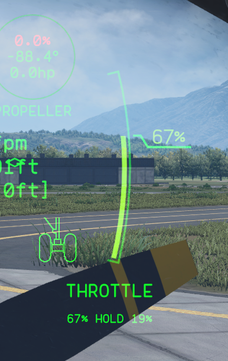

# Nuclear Option Detents

A small client-side BepInEx 5 mod for the Windows Steam version of Nuclear
Option that stops you from opening the airbrake or lighting the afterburner
by accident.

With relative throttle controls (the default keyboard throttle), the ends of
the throttle range are also switches: reaching 0% opens the automatic
airbrake, and pushing past full dry thrust engages the afterburner. The
throttle slides while the key is held, so releasing a millisecond too late
deploys the airbrake on final or lights the burner when you wanted full
military power.

This mod adds a detent at each end, like the physical stop on a real HOTAS
throttle. The throttle catches at the boundary instead of sliding straight
through, giving you a window to release the key:

- Just above 0%: keep holding decrease for 200 ms to reach true idle and let
  the automatic airbrake open.
- At full dry thrust: keep holding increase for 200 ms to enter afterburner.

Release the key early and the throttle just stays at the stop; nothing
triggers. Once you've pushed through, the throttle behaves exactly as vanilla
until you move away from that end again. Both hold times are configurable
(0 to 2000 ms) and each detent can be disabled.



The mod only touches the local player's relative-throttle input. It
recognizes 19 aircraft and activates detents on 14 (listed in
[docs/AIRFRAME-PRESETS.md](docs/AIRFRAME-PRESETS.md)). It never turns the
afterburner on by itself. Absolute/HOTAS throttle mode, helicopters, AI, and
remote aircraft are untouched, as are weapons and
networking. Multiplayer use is unverified, and hosts or server moderators may
prohibit BepInEx or this mod.

The Aircraft Profile menu lists every aircraft in the game's installed
catalog. An opt-in profile can support an unknown aircraft or add interior
detents to a built-in aircraft. Unknown aircraft without an enabled profile
stay vanilla. Built-in add-on presets cover the MC-260 Chimera, F-16M King
Viper, F-99 Shrike, FS-41 Eclipse, OA-27 Cavalier, and FS-3 Ternion.

Auto Hover temporarily bypasses both detents and the sensitivity multiplier;
turning it off restores them for the local aircraft.

This is a v0.4 prototype. Installed-build notes for contributors are in
[docs/COMPATIBILITY.md](docs/COMPATIBILITY.md).

## Install

Download the plugin-only, standalone, or NOMM ZIP from the
[releases page](https://github.com/baanish/NO-Throttle-Detents/releases).
Each release includes a `SHA256SUMS.txt` for the archives. Building from
source is optional; see the section below.

For an existing BepInEx installation, extract the plugin-only ZIP into the
folder containing `NuclearOption.exe` and merge its `BepInEx` folder. The
plugin is installed at:

```text
BepInEx\plugins\NuclearOptionDetents\NuclearOptionDetents.dll
```

For a fresh install, extract the standalone ZIP directly beside
`NuclearOption.exe`. It includes BepInEx and the mod's default config. Do not
add an extra wrapper directory or extract it over an existing BepInEx
installation. This release supports BepInEx 5; BepInEx 6 will not load it.

The mod config is:

```text
BepInEx\config\com.baanish.nuclearoption.detents.cfg
```

The standalone ZIP includes the default file. The plugin-only ZIP omits it;
BepInEx creates it on first launch and preserves existing settings.

Nuclear Option Mod Manager uses the separate flat `-nomm.zip` artifact. Do not
manually extract that archive into the game directory. NOMM installs it inside
its managed plugin directory and supplies BepInEx.

To remove or disable only this mod, delete its plugin directory or rename the
DLL. Leave unrelated BepInEx and game files alone.

## Configuration

The default config is:

```ini
[General]
Enabled = true
DebugLogging = false
NetworkValidation = false
NetworkValidationOwner = -1

[Indicator]
Enabled = true

[Throttle Sensitivity]
Multiplier = 1

[Status]
RuntimeStatus = Open the in-game Configuration Manager to see the live check.

[Idle / Airbrake Detent]
Enabled = true
HoldMilliseconds = 200

[Full Dry / Afterburner Detent]
Enabled = true
HoldMilliseconds = 200

[Custom Aircraft]
DetectedAircraft =
SelectedAircraftId =

[Advanced]
CommandThreshold = 0.5
EndpointEpsilon = 0.001
ResetHysteresis = 0.02
```

Each detent has its own switch and dwell from 0 to 2000 ms. A zero dwell
unlocks on the first qualifying endpoint update. The HUD indicator appears
below the throttle gauge only while a detent is blocking movement. `Multiplier`
scales relative-throttle movement from 0.25x to 4x on aircraft with a supported
detent; 1x preserves the game rate. Other aircraft keep vanilla sensitivity.
`CommandThreshold` is the
raw input magnitude required to hold; `1.0` requires full-scale input.
`EndpointEpsilon` tolerates float noise; `ResetHysteresis` controls how far the
throttle must move away before an unlocked detent relocks and is always at
least the endpoint tolerance. `DebugLogging` is off by default and is useful
when diagnosing a local install. `NetworkValidation` is a separate opt-in
multiplayer diagnostic; keep it off during normal play. See
[docs/NETWORK-VALIDATION.md](docs/NETWORK-VALIDATION.md) for the two-client
check and log analyzer.

The Aircraft Profile selector lists aircraft in the game's installed-aircraft
catalog. Entering an aircraft also adds its exact `jsonKey` as a fallback. Each
aircraft keeps an independent profile. Selecting a profile changes only which
profile the menu edits. The runtime always uses the profile matching the local
aircraft. Reset Profile restores only that profile. Choose the airbrake
type and, when applicable, enter the live afterburner nozzle count and range.
Those components must still match before an endpoint detent can run.



Each profile accepts up to eight comma-separated custom detent positions, such
as `67,82.5`. These are the percentages shown on the cockpit throttle gauge.
The mod reads that gauge's dry-throttle range for the active aircraft so its
hold label and the cockpit number agree. Custom detents stop travel in both
directions and share that profile's hold time. Values must be greater than 0
and less than 100. A malformed list disables the custom detents.



The mod does not require Configuration Manager. Cataloged aircraft get a
generated `[Custom Aircraft Profile ...]` section that can be edited in the
config file; text-file changes apply on the next launch.

PauelsRandomFixes' ThrottleRelativeVelocity is supported. While that fix is
active, its Relative Sensitivity setting takes priority and this mod's
Multiplier is ignored. Detents also yields when another Harmony patch is
actively publishing the local throttle. Other airbrake, afterburner, or
autopilot changes may still conflict; test them together.
Use PauelsRandomFixes if you want sensitivity control on aircraft without a
supported detent.

## Runtime cost and mod conflicts

Normal operation patches one local-pilot throttle method. The mod does not run
detent code on AI or remote aircraft, and it does not patch every airbrake,
control surface, engine, or afterburner in a mission. It checks the selected
aircraft's capabilities when you enter the seat, then retries only while an
expected component is still loading.

At each seat entry, the mod checks whether another Harmony patch shares the
throttle method. If that patch publishes a value outside the game's relative
throttle accumulator, detents and sensitivity yield until vanilla control
returns. This avoids competing with active autopilot or throttle overrides
without disabling Detents just because another mod is installed.

Network Validation is the expensive diagnostic path. It remains off by
default. When enabled with Debug Logging, it samples only the local aircraft
and one selected remote aircraft at 10 Hz.

## Compatibility and testing

The installed-build snapshot in [docs/COMPATIBILITY.md](docs/COMPATIBILITY.md)
records the game version, patch points, and fields inspected during
development. It is contributor reference, not a promise that future game
builds will work. After a game update, run the mod and the focused core tests;
those tests do not exercise Harmony installation or live-game integration.

Recorded v0.1 testing covered identity and readiness on all 13 allowlisted
airframes plus reduced-dwell upper/lower control-path checks on FS-12, FS-20,
KR-67, and AB-4.

## Build from source

From PowerShell 7, run the one-command build:

```powershell
pwsh ./build/Build.ps1
```

The script runs the focused core tests and network-analyzer self-test, builds
the Release plugin, creates the NOMM, manual plugin-only, and standalone ZIP
layouts, and validates their contents. It finds Nuclear Option through Steam
locations when possible.
To select it explicitly, pass a directory or set the environment variable:

```powershell
pwsh ./build/Build.ps1 -GameDir 'C:\Games\Nuclear Option'
$env:NUCLEAR_OPTION_DIR = 'C:\Games\Nuclear Option'
pwsh ./build/Build.ps1
```

Artifacts are written to `dist`. The source is MIT licensed; see
`THIRD_PARTY_NOTICES.md` for bundled dependency attribution.
