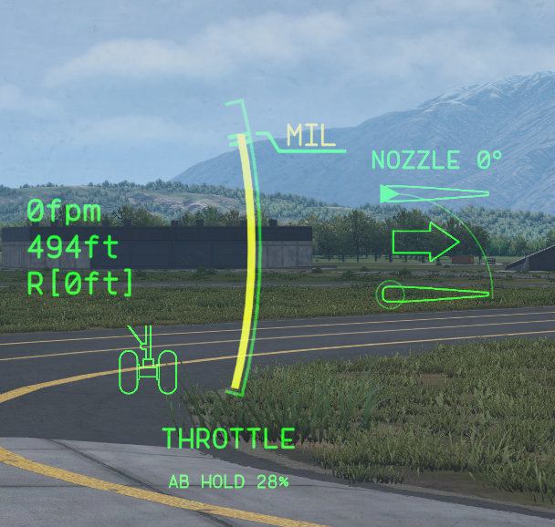
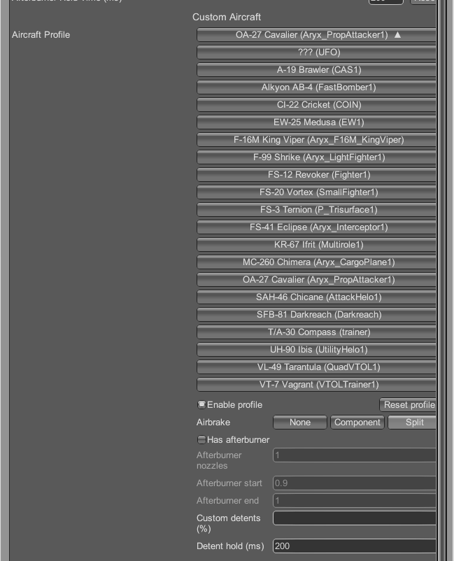
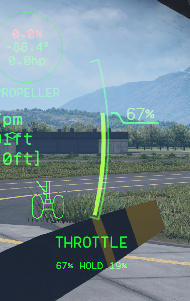

# Nuclear Option Detents

A client-side BepInEx 5 mod for the Windows Steam version of Nuclear Option.
It stops you from opening the airbrake or lighting the afterburner by accident
when you fly with the keyboard.

With a keyboard throttle, the ends of the range are also switches. Reaching 0% opens the automatic airbrake, and pushing past full dry
thrust engages the afterburner. The throttle keeps sliding while you hold the key, so letting go
a moment too late deploys the airbrake on final or lights the burner when you
wanted full military power.

This mod adds a detent at each end, like the stop on a real HOTAS throttle.
The throttle catches at the boundary, and you keep holding to go through:

- Just above 0%, hold decrease for 200 ms to reach idle and let the airbrake
  open.
- At full dry thrust, hold increase for 200 ms to enter afterburner.

Let go early and the throttle stays at the stop. Once you are through, the
throttle behaves as vanilla until you move away from that end again. Both
hold times are adjustable, and either detent can be turned off.



The mod changes only the local player's keyboard or button throttle input, with
the game's Use Throttle Relative Axis setting on or off. It never turns the
afterburner on by itself. Analog throttle axes (HOTAS levers, sliders, and
sticks) are not supported and stay vanilla, as do helicopters and other
collective aircraft, AI, and other players' aircraft.

## Install

Download one ZIP from the
[releases page](https://github.com/baanish/NO-Throttle-Detents/releases).
`SHA256SUMS.txt` on the same page lists each archive's hash.

| You have | Download | Do this |
| --- | --- | --- |
| No BepInEx | `-standalone-fresh-install-win-x64.zip` | Extract its contents beside `NuclearOption.exe`, with no extra folder. It includes BepInEx 5.4.23.5 and the default config. |
| BepInEx 5 already | `-plugin-only.zip` | Extract it beside `NuclearOption.exe` and merge the `BepInEx` folder. It leaves your BepInEx and mod config alone. |
| Nuclear Option Mod Manager | `-nomm.zip` | Install through NOMM, which supplies BepInEx. Do not extract it into the game folder. |

BepInEx 6 does not load this mod.

Launch the game. `BepInEx\LogOutput.log` should contain
`Nuclear Option Detents <version> loaded.`

The F1 menu comes from
[BepInEx Configuration Manager](https://github.com/BepInEx/BepInEx.ConfigurationManager),
which you install separately. The mod works without it.

## Supported aircraft

The mod recognizes 20 aircraft and puts a detent on 15 of them: base-game
aircraft plus optional Aryx and Ternion add-on aircraft.
[docs/AIRFRAME-PRESETS.md](docs/AIRFRAME-PRESETS.md) lists each one and
which detents it gets. An aircraft the mod does not recognize stays vanilla
unless you turn on a custom profile for it.

## Custom aircraft profiles

The Aircraft Profile menu in F1 lists every aircraft in the game's installed
catalog, and each aircraft keeps its own profile. A profile can do two things:

- Give an unrecognized aircraft idle and afterburner detents. Choose its
  airbrake type and, if it has afterburner, its nozzle count and throttle
  range. The mod still checks that the aircraft's parts match before a detent
  runs.
- Add up to eight detents inside the dry range, on any non-collective
  aircraft.



Enter custom detents as comma-separated percentages, such as `67,82.5`. They
match the percentage on the aircraft's throttle gauge, stop the throttle in
both directions, and share the profile's hold time. Each value must be above 0
and below 100. A malformed list turns that profile's custom detents off.



The menu you pick in F1 changes only which profile you edit. In flight, the
mod always uses the profile of the aircraft you are sitting in. Each profile
is also a `[Custom Aircraft Profile ...]` section in the config file. Edits to
the file apply on the next launch.

## Settings

Settings live in `BepInEx\config\com.baanish.nuclearoption.detents.cfg`.
BepInEx creates the file on first launch if the package did not include it.

| Section | Setting | Default | Range | Effect |
| --- | --- | --- | --- | --- |
| General | `Enabled` | `true` | | Off makes the whole mod vanilla. |
| General | `DebugLogging` | `false` | | Logs aircraft attach and reset events to `BepInEx\LogOutput.log`. |
| General | `NetworkValidation`, `NetworkValidationOwner` | `false`, `-1` | owner -1 to 255 | Multiplayer diagnostic, off for normal play. See [docs/NETWORK-VALIDATION.md](docs/NETWORK-VALIDATION.md). |
| Indicator | `Enabled` | `true` | | Shows the hold below the HUD throttle gauge while a detent stops the throttle. |
| Throttle Sensitivity | `Multiplier` | `1` | 0.25 to 4 | Scales keyboard throttle speed on aircraft with a detent. Other aircraft keep the game's rate. |
| Idle / Airbrake Detent | `Enabled`, `HoldMilliseconds` | `true`, `200` | 0 to 2000 ms | The idle detent and its hold time. 0 lets the throttle through on the first push. |
| Full Dry / Afterburner Detent | `Enabled`, `HoldMilliseconds` | `true`, `200` | 0 to 2000 ms | The afterburner detent and its hold time. |
| Advanced | `EndpointEpsilon` | `0.001` | 0.00001 to 0.05 | How close to a boundary the throttle must be to start a hold. |
| Advanced | `ResetHysteresis` | `0.02` | 0.001 to 0.10 | How far the throttle must move back before a passed detent locks again. Never less than `EndpointEpsilon`. |

While an analog axis drives the throttle, the mod's `RuntimeStatus` line in
the F1 menu reads `NOT APPLICABLE - Analog throttle axis not supported`.

Auto Hover bypasses the detents and the sensitivity multiplier while it is on.

## Other mods

- PauelsRandomFixes' ThrottleRelativeVelocity fix works with the detents. While it is active, its
  Relative Sensitivity setting replaces this mod's `Multiplier`. Use it if you
  want sensitivity control on aircraft without a detent.
- If another mod takes over the local throttle, such as an autopilot, the
  detents step aside until the game's own throttle control returns.
- Other airbrake, afterburner, or autopilot mods may still conflict. Test them
  together.

## Multiplayer

Multiplayer use is unverified. Server hosts and moderators may prohibit
BepInEx or this mod. The mod runs only on your client and does not touch
networking, weapons, or other players' aircraft.

## Testing status

This is a v0.4 prototype. Each release in [CHANGELOG.md](CHANGELOG.md) records
its manual checks and the game build they ran on. The latest checks were on Nuclear
Option 0.34.2, Steam build 24724372. A game update can break the throttle
patch. If it does, the mod logs the failure and leaves the throttle vanilla.

## Uninstall

Delete `BepInEx\plugins\NuclearOptionDetents`, and optionally
`BepInEx\config\com.baanish.nuclearoption.detents.cfg`. NOMM users remove it
in NOMM. Leave other BepInEx and game files alone.

## Build from source

From PowerShell 7:

```powershell
pwsh ./build/Build.ps1
```

The script runs the focused tests, builds the Release plugin, and writes the
three validated ZIPs to `dist`. It finds Nuclear Option through Steam. To
point it at a specific install, pass `-GameDir 'C:\path\to\Nuclear Option'`
or set `NUCLEAR_OPTION_DIR`.

Contributor docs: [how it works](docs/DESIGN.md),
[game-build compatibility](docs/COMPATIBILITY.md), and
[airframe presets](docs/AIRFRAME-PRESETS.md).

MIT licensed. Bundled dependency attribution is in
[THIRD_PARTY_NOTICES.md](THIRD_PARTY_NOTICES.md).
